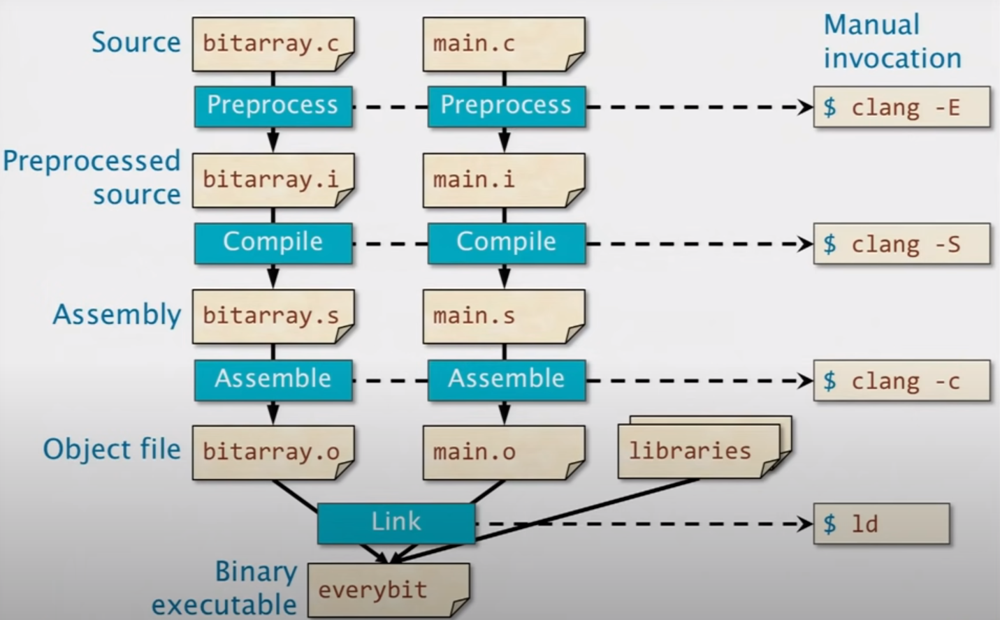
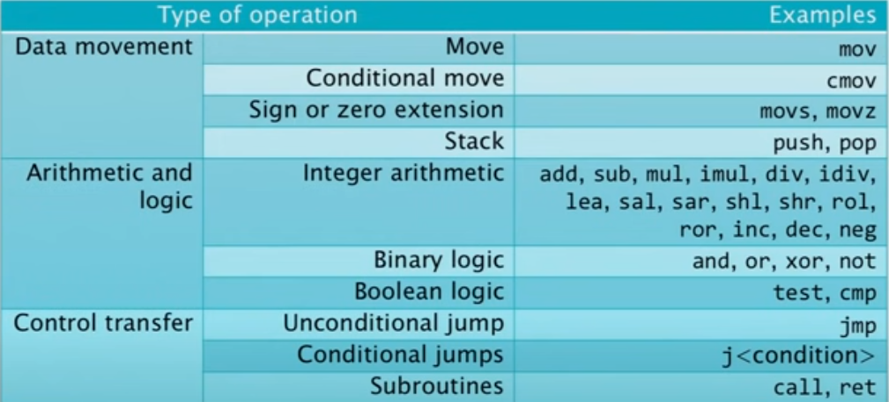
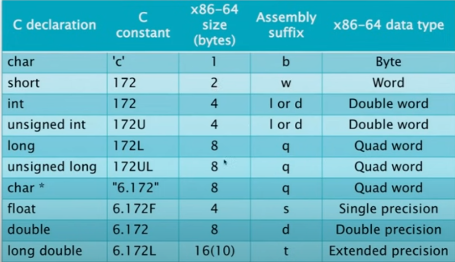
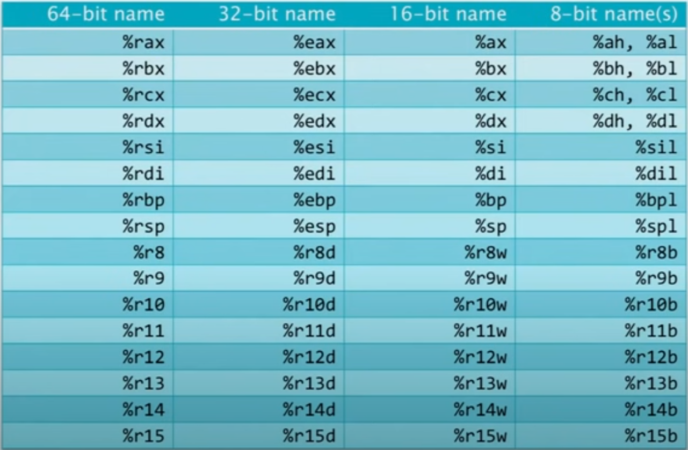

## Four steps of compilation

1. Preprocessing
2. Compiling
3. Assemble
4. Linking



## Instruction Format

`<opcode> <operand_list>`

The operand list includes source and destination

> In AT&T syntax, the last operand is destination.

> In Intel syntax, the last operand is source.

## Common x86_64 Opcodes



## Data Types



Example:

```asm
movq rbp, rax ; q suffix stands for quadword
```

movq : move a 64-bit (quadword) integer.

## Sections

We will have 3 sections in our program:

1. `section .data`
2. `section .bss`
3. `section .text`

> section .data : define constant variables, string, numbers, etc.

> section .bss : reserve memory space for future data

> section .text : our actual programs. contains labels: _start or main

**What is label ?**
They are simply symbols for addresses.
Example : label your jump target instruction and the assembler will resolve the correct address when you build the machine code.

**When to use _start and main label ?**
ld linker requires `_start` label.
gcc linker requires `main` label.
So, it depends on your linker.

## Registers

Registers is hardware implemented variables. It's a place where processor store things.

**GENERAL PURPOSE REGISTERS**




## Arithmetics Operations

```asm
; addition
add rax, 12 ; rax = rax + 12

; substraction
sub rax, 1 ; rax = rax - 1

; multiply (rax * rbx), then store the result to rax
mov rax, 12
mul rbx

; divide (rax / rbx), then store the result to rax
mov rax, 12
div rbx
```